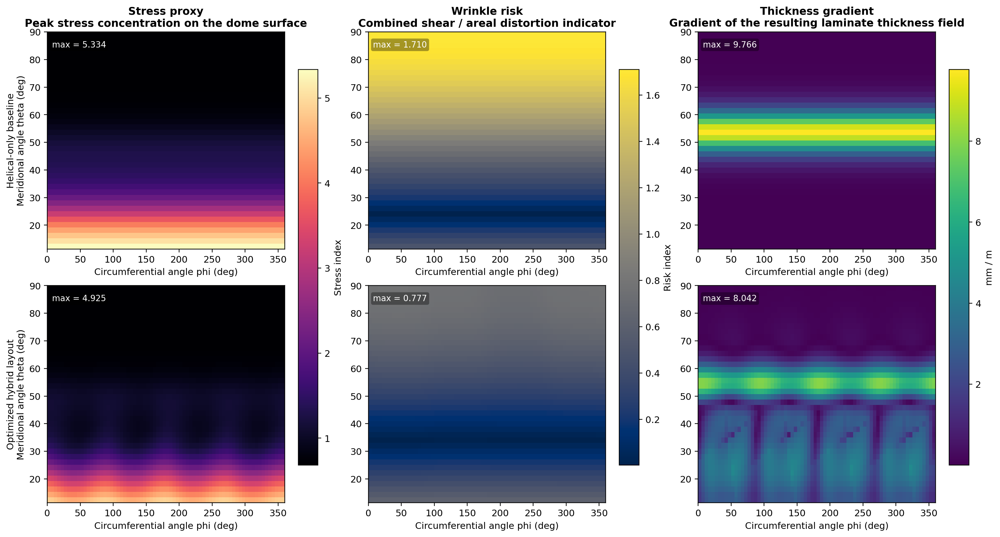
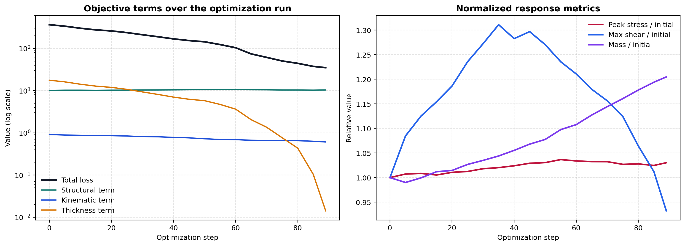

# FPP-JAX-Optimizer

FPP-JAX-Optimizer is a differentiable optimization toolkit for Fiber Patch Placement (FPP) on Type IV COPV domes. It couples patch layout, kinematic feasibility, thickness buildup, and a smooth pressure-response proxy in a single JAX optimization loop, then exports the optimized reinforcement layout to downstream analysis formats.


## What The Module Does

The module starts from a helical-only dome baseline and jointly optimizes:

- patch center locations on the dome surface
- patch orientation and footprint size
- local ply intensity for each patch
- the helical-to-FPP transition boundary
- manufacturability penalties for wrinkle risk and thickness cliffs
- a structural pressure-response proxy on the same differentiable surface

That means the package is not just drawing patches on a dome. It is solving a coupled design problem where structural response, kinematic feasibility, and laminate smoothness all influence the final layout.

## Result Snapshot

These numbers are from the default 90-step demonstration run that generated the README visuals.

| Metric | Helical-only baseline | Optimized hybrid FPP | Change |
| --- | ---: | ---: | ---: |
| Peak stress index | 5.334 | 4.925 | -7.7% |
| Max shear | 0.1160 | 0.1081 | -6.8% |
| Max areal distortion | 0.1569 | 0.1446 | -7.8% |
| Max thickness gradient (mm/m) | 9.77 | 8.04 | -17.7% |
| Total mass (kg) | 0.1095 | 0.1455 | +32.8% |

The optimized hybrid layup adds `37.5 g` of local patch reinforcement and still retains `30.1%` cost saving versus an equivalent all-FPP laminate.

## What Changes On The Dome



The comparison above shows what the optimizer is actually changing:

- `Stress proxy`
  The high-stress region near the boss remains dominant, but the optimized layout reduces the peak and redistributes the surrounding load path.
- `Wrinkle risk`
  The optimized patch placement suppresses the most severe shear / areal distortion concentrations around the transition region.
- `Thickness gradient`
  The optimizer smooths the laminate buildup where the helical region hands off to local reinforcement, removing the strongest thickness cliff from the baseline.

## Optimization Trace



The optimization history shows a steep drop in total loss while the thickness penalty collapses by orders of magnitude. The mass term rises because the optimizer is intentionally adding local reinforcement to reduce stress concentration and improve manufacturability.

## Minimal API

```python
from fpp_jax_optimizer import optimize_patch_layout, summarize_result

result = optimize_patch_layout()
summary = summarize_result(result)

print(summary["optimized_peak_stress_index"])
print(summary["cost_savings_vs_all_fpp_pct"])
```

The returned `result` bundle contains:

- `baseline`
  Metrics and fields for the helical-only baseline
- `optimized`
  Metrics and fields for the optimized hybrid layout
- `history`
  Optimization trace for loss and response metrics
- `layout_serialized`
  Patch centers, sizes, angles, ply intensities, and transition boundary

## Features

- Oblate ellipsoidal dome parameterization in spherical coordinates
- Smooth differentiable patch masks for center, size, orientation, and ply-intensity optimization
- Jacobian-based shear and distortion penalties for manufacturability screening
- Thickness accumulation and gradient penalties for laminate smoothness
- Differentiable structural proxy for internal-pressure-driven optimization
- Export to Nastran-compatible shell decks and JSON summaries

## Repository Structure

```text
FPP-JAX-Optimizer/
  src/
    fpp_jax_optimizer/
      __init__.py
      config.py
      core/
        geometry.py
        kinematics.py
      model/
        fem.py
        loss.py
      topology/
        mapping.py
      io/
        export.py
  tests/
    conftest.py
    test_kinematics.py
    test_gradients.py
  examples/
    type_iv_dome_workflow.ipynb
  assets/
    optimized_dome_overview.png
    field_comparison.png
    optimization_convergence.png
  outputs/
    .gitkeep
  tools/
    generate_readme_assets.py
  requirements.txt
  setup.py
  README.md
```

## Optimization Workflow

1. Build the Type IV dome grid in `(\theta, \phi)`.
2. Define smooth FPP patches with center, size, orientation, and ply-intensity parameters.
3. Evaluate coupled structural, kinematic, and thickness objectives.
4. Run gradient-based optimization in JAX to move, rotate, resize, and taper the patches.
5. Export the optimized layout to `.bdf`, JSON, and optional visualization artifacts.

## Demonstration Geometry

The included workflow uses a representative Type IV dome configuration:

- oblate ellipsoidal dome
- `R_major / R_minor = 1.414`
- `50 mm` polar opening
- baseline helical spillover layer plus optimized FPP reinforcement

## Quick Start

Install the package and its dependencies:

```bash
pip install -r requirements.txt
pip install -e .
```

Run the tests:

```bash
pytest
```

Open the example notebook:

```bash
jupyter lab examples/type_iv_dome_workflow.ipynb
```

## Generated Artifacts

Typical outputs are written to `outputs/`:

- `fpp_type_iv_dome.bdf`
- `fpp_layout.html`
- `optimization_summary.json`

To regenerate the README figures from the default run:

```bash
python tools/generate_readme_assets.py
```

## Scope

This repository is a technical prototype, not a certification-grade structural solver. The structural path uses a smooth pressure/stress proxy rather than a full shell finite-element implementation, but the package layout keeps the geometry, kinematics, optimization, and export layers modular for higher-fidelity extensions.
