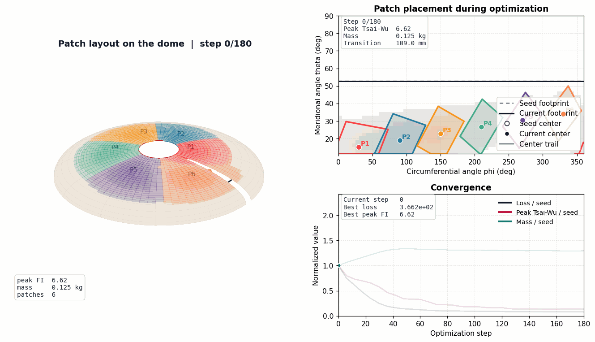
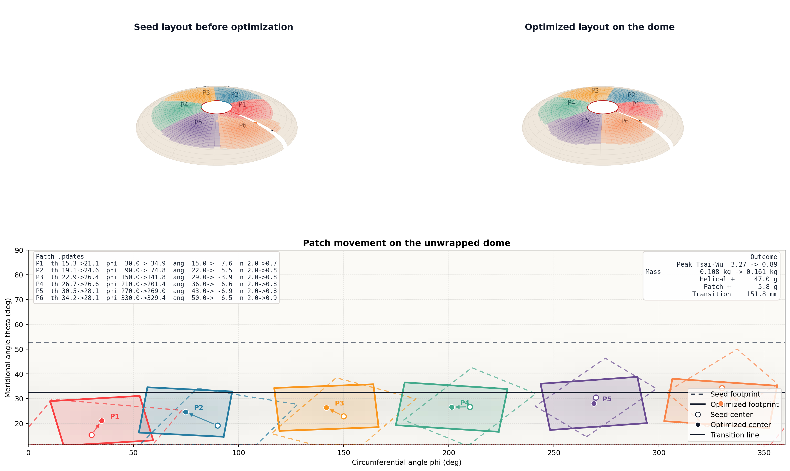

# FPP-JAX-Optimizer

FPP-JAX-Optimizer is a differentiable optimization toolkit for Fiber Patch Placement (FPP) on Type IV COPV domes. The current package couples dome geometry, smooth patch masks, kinematic screening, laminate thickness buildup, analytical membrane loads, classical laminate theory, and a Tsai-Wu failure objective in one JAX optimization loop.



The animation above is the current default demonstration output. It shows the patch footprints evolving on the dome, the same motion on the unwrapped dome, and the objective convergence through the run.

## What It Optimizes

The optimizer does not just paint patches onto a shell. It jointly updates:

- patch center location in `theta` and `phi`
- patch footprint length and width
- patch fiber angle
- patch ply count
- the helical-to-FPP transition boundary
- manufacturability penalties from shear, areal distortion, and thickness gradients
- laminate response under internal pressure through Tsai-Wu failure index

## Current Mechanics Workflow

The current structural path is no longer the old heuristic stress proxy. The workflow is:

1. Build the oblate ellipsoidal dome grid in `(\theta, \phi)`.
2. Seed a differentiable set of FPP patches across the dome.
3. Convert raw optimizer parameters into smooth patch masks and laminate thickness fields.
4. Evaluate kinematic feasibility with Jacobian-based shear and areal distortion penalties.
5. Compute analytical membrane stress resultants for the pressurized dome.
6. Assemble the laminate `A`-matrix from the helical baseline plies and the optimizer-controlled patches.
7. Solve for midplane strains and evaluate a Tsai-Wu failure field.
8. Use smooth support weights in the loss so sub-ply patch tails and helical taper regions remain differentiable during optimization.
9. Report Tsai-Wu and kinematic peaks only on supported laminate regions (`>= 0.5` effective patch plies, `>= 1.0` helical plies), so README/export metrics are not suppressed by the smooth surrogate.
10. Combine structural, kinematic, thickness, and mass terms into one loss and optimize it with Adam, then record layout snapshots through the run.

## Default Demonstration Run

These numbers come from the current default asset-generation run (`6` patches, `180` Adam steps).

| Metric | Helical-only baseline | Optimized hybrid demo |
| --- | ---: | ---: |
| Peak Tsai-Wu index | 3.272 | 0.894 |
| Total mass (kg) | 0.1084 | 0.1612 |
| Added helical mass (kg) | 0.0000 | 0.0470 |
| Patch mass added (kg) | 0.0000 | 0.0058 |
| Cost saving vs all-FPP laminate | - | 39.1% |
| Transition height (mm) | 109.0 | 151.8 |
| Max shear strain in supported patch footprint | 0.0000 | 0.0295 |
| Max areal distortion in supported patch footprint | 0.0000 | 0.0948 |
| Max thickness gradient (mm/m) | 4.91 | 4.34 |

`Tsai-Wu < 1` means the laminate is predicted to stay below ply failure under the analytical membrane solution. The values in the table above are now reported on supported laminate regions only, instead of being damped by the smooth optimization surrogate.

The current default README run is intentionally a low-pressure demo configuration (`pressure_mpa = 0.5`, `baseline_helical_plies = 4`, `transition_smooth_theta = 0.12`) so the failure-index values stay interpretable on a compact prototype laminate. For realistic 70 MPa studies, increase the baseline laminate thickness and retune both the transition model and the loss weights accordingly.

The default demo is also now explicit about what is doing the work: most of the added mass still comes from moving the helical/FPP transition toward the boss (`+47.0 g` helical versus `+5.8 g` patch mass). This is a coupled transition-and-patch optimization, not a patch-only ablation.

The run is mechanically honest now, but it is still not a release-ready design workflow: the supported patch footprints remain above the nominal areal-distortion allowable, so the repository should still be read as a research prototype rather than a finished manufacturing pipeline.

## Visual Outputs

The asset pipeline currently writes:

- `assets/optimization_evolution.gif`
  Full layout-evolution animation with dome view, unwrapped patch map, and convergence panel.
- `assets/optimized_dome_overview.png`
  Seed-vs-optimized patch placement on the dome plus the unwrapped movement map.
- `assets/field_comparison.png`
  Baseline-vs-optimized Tsai-Wu, wrinkle-risk, and thickness-gradient fields.
- `assets/tsai_wu_comparison.png`
  Baseline-vs-optimized Tsai-Wu comparison only.
- `assets/optimization_convergence.png`
  Static convergence plots for loss and normalized metrics.



## Minimal API

```python
from fpp_jax_optimizer import optimize_patch_layout, summarize_result

result = optimize_patch_layout()
summary = summarize_result(result)

print(summary["optimized_peak_stress_index"])
print(summary["optimized_mass_kg"])
print(len(result["frames"]))
```

The returned `result` bundle includes:

- `baseline`
  Helical-only baseline response.
- `optimized`
  Best layout found in the run.
- `history`
  Scalar convergence trace.
- `frames`
  Serialized layout snapshots used to render the GIF.
- `layout_serialized`
  Final patch centers, angles, sizes, plies, and transition boundary.

## Export Workflow

Typical usage after optimization is:

```python
from pathlib import Path

from fpp_jax_optimizer import (
    optimize_patch_layout,
    write_nastran_bdf,
    write_summary_json,
)

result = optimize_patch_layout()

write_summary_json(result, Path("outputs") / "optimization_summary.json")
write_nastran_bdf(result, Path("outputs") / "fpp_type_iv_dome.bdf")
```

The package currently exports:

- JSON optimization summaries
- Nastran-compatible `PCOMP` / `CQUAD4` shell decks
- README-ready visualization assets through `tools/generate_readme_assets.py`

## Repository Structure

```text
FPP-JAX-Optimizer/
  assets/
    field_comparison.png
    optimization_convergence.png
    optimization_evolution.gif
    optimized_dome_overview.png
    tsai_wu_comparison.png
  examples/
    type_iv_dome_workflow.ipynb
  src/
    fpp_jax_optimizer/
      config.py
      core/
        geometry.py
        kinematics.py
      io/
        export.py
      model/
        fem.py
        loss.py
      topology/
        mapping.py
  tests/
    conftest.py
    test_gradients.py
    test_kinematics.py
    test_mechanics.py
    test_optimization_frames.py
  tools/
    generate_readme_assets.py
  pyproject.toml
  requirements.txt
  setup.py
  README.md
```

## Quick Start

Install dependencies and the package:

```bash
pip install -r requirements.txt
pip install -e .
```

Run the tests:

```bash
pytest
```

Regenerate the current README assets:

```bash
python tools/generate_readme_assets.py
```

Open the notebook workflow:

```bash
jupyter lab examples/type_iv_dome_workflow.ipynb
```

## Current Dependencies

The package currently expects:

- `jax`
- `jaxlib`
- `optax`
- `numpy`
- `scipy`
- `matplotlib`
- `plotly`
- `Pillow`

## Scope

This repository is a technical prototype for coupled FPP layout exploration. It is useful for studying how patch position, orientation, thickness buildup, and laminate mechanics interact on a dome, but it is not a certification-grade shell solver or manufacturing release tool. The code is structured so that higher-fidelity mechanics, better constraints, and improved export paths can be added without rewriting the whole package.
